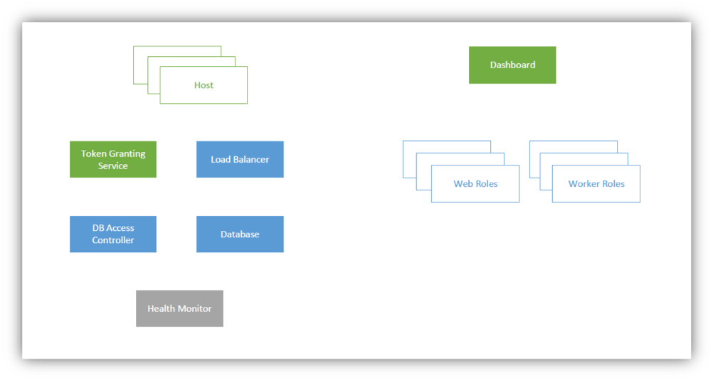
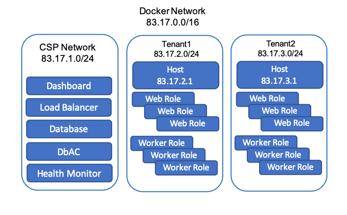

 RainMaker - PaaS System on containers

October 2017

# Introduction
RainMaker is a mini-PaaS architecture designed to help users understand the working of a cloud system. Its compact design and easy-to-implement API set helps users to develop their own PaaS system on a small scale, hosting a toy application.

# Architecture

# Components

## Hosts
Host operates on the public IP, and is internet-facing. It is responsible for relaying messages between the end-user and the other components. Each Tenant’s Web Application is hosted on a different Host instance (with a different IP).

## Dashboard
The Dashboard component serves the Tenant and Developer dashboards. All components can be monitored from here. Various statistics about the each of the components are represented using graphical visualizations. The Tenant can monitor web roles and worker roles, create new web roles and worker roles, and be notified of any errors. The developer can access the log files of all components to fix errors, if any.

## Token Granting Service
The TGS module authenticates End-User, Tenant and Developer accounts. For the sake of simplicity, all users are assumed to be created beforehand. This module is responsible for verifying the login credentials and generating a token based on those credentials, to identify each user. This token (in the form of a session key) is used for all subsequent communications with RainMaker.

## Load Balancer
This component keeps track of the load distribution among web roles and worker roles, and ensures that it is uniform. Other components may request the Load Balancer for an available web role or a worker role. The Load Balancer then chooses a suitable web role / worker role and returns the IP address. It is also expected to consider affinities between End-Users and Web Roles while load balancing. Automated dynamic creation of web roles and worker roles based on the requirement can be implemented as an additional feature1.

## Database Access Controller
The DAC is responsible for cleaning, and parsing the database queries sent by the web roles and worker roles, and convert them in accordance to the multi-tenancy rules. Neither the web roles nor the worker roles are allowed direct access to the database. All other components can access the database directly.

## Database
This component houses a MySQL database, which is used to store the tenant data as well as other metadata necessary for the functioning of RainMaker.

## Health Monitor
This module ensures that all other components are active and are functioning as expected. It polls each component at regular intervals, and notifies the Dashboard of their health. In the event of a failure, a failover mechanism kicks in2.

## Web Roles
The Web Role serves the frontend of the Tenant’s application to the End User. RainMaker currently supports tenant applications that have a web interface. Typically, all foreground operations are managed by the Web Role. These include serving webpages, receiving files from the End-User, updating the database, and offloading further processing to worker roles. In contrast to worker roles, a web role is usually active only till the End-User is active.

## Worker Roles
Worker Roles are responsible for background tasks which do not require End-User interaction. Worker roles can be used to supplement web roles - the web role can handover a task to the worker role and be ready to receive new incoming connections rather than being preoccupied with backend tasks. Worker Roles can also be used to perform persistent maintenance tasks, apart from the tasks assigned by web roles.

# Control Flow
## End-User
- The End-User contacts the Host through the internet facing IP address.
- Host module requests the TGS to issue an End-User token.
- The Host then obtains a Web Role IP address from the Load Balancer.
- The End-User’s request is forwarded to the assigned Web Role by the Host, along with the token.
- The Web Role sends the relevant webpages back to the Host.
- The Host forwards the webpages along with the token to the End-User. The End-User is expected to transmit the token along with the message data in all subsequent requests.
- If the web role needs to access the database, a query is sent to the Database Access Controller, which in turn forwards it to the Database.
- The Health Monitor passively pings all components at regular intervals, and updates the Dashboard accordingly.

## Tenant
- The Dashboard also has an internet-facing public IP address, using which the Tenant can login.
- The Tenant can configure their application on this page – the number of worker and web roles, uploading the web role and worker role applications, etc. The Dashboard creates the required number of web roles and worker roles.
- The Tenant can also restart his/her app.

## Developer
The Developer can login to the Dashboard to access the log files of all the components.

  
# Network (Docker)

---
1Yet to decide feasibility and implementation details. 2The implementation of this feature is optional. It is left to the interests and capabilities of the user.

---
